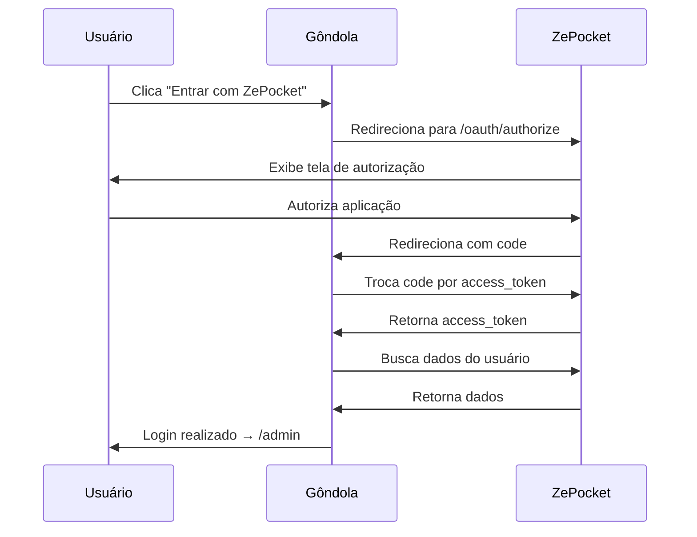

# 🔐 Guia de Integração OAuth ZePocket

## ✅ Configuração Implementada

O sistema **ZePocket Gôndola** está configurado para autenticação via OAuth 2.0 com sua aplicação base ZePocket.

---

## 📋 Arquivos Implementados

### 1. Custom OAuth Provider

✅ [app/Services/Socialite/ZepocketProvider.php](app/Services/Socialite/ZepocketProvider.php)

```php
// Scopes configurados:
- user-read      # Leitura de dados do usuário
- user-email     # Acesso ao e-mail
- gadgets-read   # Leitura de gadgets (opcional)
```

### 2. Controller de Autenticação

✅ [app/Http/Controllers/Auth/ZepocketAuthController.php](app/Http/Controllers/Auth/ZepocketAuthController.php)

**Métodos:**

-   `redirect()` - Redireciona para página de login do ZePocket
-   `callback()` - Processa retorno do OAuth
-   `logout()` - Desconecta usuário

### 3. Rotas Configuradas

✅ [routes/web.php](routes/web.php)

```
GET  /auth/zepocket           → Inicia OAuth
GET  /auth/zepocket/callback  → Recebe dados do usuário
POST /logout                   → Desconecta
```

### 4. Página de Login

✅ [resources/views/auth/login.blade.php](resources/views/auth/login.blade.php)

Interface moderna com:

-   Botão "Entrar com ZePocket"
-   Login tradicional (fallback)
-   Design responsivo

---

## 🔧 Configuração no .env

Edite o arquivo `.env` com as credenciais do seu OAuth Client:

```env
# ZePocket OAuth2 Configuration
ZEPOCKET_CLIENT_ID=1
ZEPOCKET_CLIENT_SECRET=seu_client_secret_aqui
ZEPOCKET_REDIRECT_URI=http://127.0.0.1:8001/auth/zepocket/callback
ZEPOCKET_BASE_URL=https://zepocket.com
```

### Como Obter as Credenciais?

1. Acesse o painel de OAuth Clients no ZePocket
2. Crie um novo Client com os dados:
    - **Nome:** ZePocket Gôndola
    - **Redirect URI:** `http://127.0.0.1:8001/auth/zepocket/callback`
    - **Scopes:** `user-read`, `user-email`, `gadgets-read`
3. Copie o `Client ID` e `Client Secret`
4. Cole no arquivo `.env`

---

## 🚀 Executar Migration

Para adicionar as colunas de tokens OAuth:

```bash
php artisan migrate
```

Isso criará as colunas:

-   `zepocket_token` - Access token
-   `zepocket_refresh_token` - Refresh token

---

## 🧪 Testar a Integração

### 1. Iniciar Servidor

```bash
php artisan serve
```

### 2. Acessar Página de Login

```
http://127.0.0.1:8001/login
```

### 3. Clicar em "Entrar com ZePocket"

O fluxo será:

1. Redireciona para `https://zepocket.com/oauth/authorize`
2. Usuário autoriza a aplicação
3. Retorna para `/auth/zepocket/callback`
4. Sistema cria/atualiza usuário local
5. Cria empresa se não existir
6. Redireciona para `/admin`

---

## 🔍 Debug e Logs

Os logs ficam em `storage/logs/laravel.log`:

```php
// Logs implementados:
✅ Dados do usuário recebidos
✅ Empresa criada
✅ Usuário autenticado
✅ Erros de OAuth
```

Para visualizar em tempo real:

```bash
tail -f storage/logs/laravel.log
```

---

## 📊 Fluxo de Autenticação



---

## 🛠️ Personalizações Disponíveis

### Adicionar Mais Scopes

```php
// app/Http/Controllers/Auth/ZepocketAuthController.php

public function redirect()
{
    return Socialite::driver('zepocket')
        ->scopes(['user-read', 'user-email', 'payments-read', 'gadgets-write'])
        ->redirect();
}
```

### Mudar Redirecionamento Após Login

```php
// No callback()
return redirect()->intended('/dashboard');  // Em vez de /admin
```

### Customizar Criação de Empresa

```php
// No callback(), modificar:
$company = Company::create([
    'name' => $user->name . ' - Loja',
    'document' => $zepocketUser->getRaw()['cnpj'] ?? '',  // Se vier do ZePocket
    'owner_id' => $zepocketUser->getId(),
]);
```

---

## 🔐 Segurança

### Tokens Armazenados

Os tokens são armazenados criptografados no banco:

-   `zepocket_token` → Usado para fazer chamadas à API
-   `zepocket_refresh_token` → Usado para renovar o access_token

### Hidden no Model

Os tokens **não** são expostos em respostas JSON:

```php
protected $hidden = [
    'password',
    'remember_token',
    'zepocket_token',           // ✅ Oculto
    'zepocket_refresh_token'    // ✅ Oculto
];
```

---

## 📡 Fazer Chamadas à API do ZePocket

Após o login, você pode usar o token armazenado:

```php
use Illuminate\Support\Facades\Http;

$user = auth()->user();

$response = Http::withToken($user->zepocket_token)
    ->get('https://zepocket.com/api/gadgets');

$gadgets = $response->json();
```

### Exemplo: Buscar Gadgets do Usuário

```php
// app/Http/Controllers/GadgetController.php

public function index()
{
    $user = auth()->user();

    $response = Http::withToken($user->zepocket_token)
        ->get(config('services.zepocket.base_url') . '/api/gadgets');

    if ($response->successful()) {
        $gadgets = $response->json();
        return view('gadgets.index', compact('gadgets'));
    }

    return back()->with('error', 'Erro ao buscar gadgets');
}
```

---

## 🔄 Renovar Token (Refresh Token)

Quando o `access_token` expirar, use o `refresh_token`:

```php
use Laravel\Socialite\Facades\Socialite;

$user = auth()->user();

$response = Http::asForm()->post(config('services.zepocket.base_url') . '/oauth/token', [
    'grant_type' => 'refresh_token',
    'refresh_token' => $user->zepocket_refresh_token,
    'client_id' => config('services.zepocket.client_id'),
    'client_secret' => config('services.zepocket.client_secret'),
]);

if ($response->successful()) {
    $data = $response->json();

    $user->update([
        'zepocket_token' => $data['access_token'],
        'zepocket_refresh_token' => $data['refresh_token'] ?? $user->zepocket_refresh_token,
    ]);
}
```

---

## ❌ Troubleshooting

### Erro: redirect_uri_mismatch

**Causa:** A URI de callback não coincide com a registrada no OAuth Client

**Solução:**

1. Verifique o `.env`: `ZEPOCKET_REDIRECT_URI`
2. Deve ser **exatamente** igual ao registrado no ZePocket
3. Incluindo `http://` ou `https://`

```bash
# ❌ Errado
ZEPOCKET_REDIRECT_URI=localhost:8001/auth/zepocket/callback

# ✅ Correto
ZEPOCKET_REDIRECT_URI=http://127.0.0.1:8001/auth/zepocket/callback
```

---

### Erro: invalid_client

**Causa:** Client ID ou Secret incorretos

**Solução:**

1. Verifique o `.env`
2. Confirme no painel do ZePocket
3. Certifique-se de não ter espaços extras

---

### Erro: "Class ZepocketProvider not found"

**Solução:**

```bash
composer dump-autoload
php artisan config:clear
php artisan cache:clear
```

---

### Token Expirado

**Sintoma:** API retorna 401 Unauthorized

**Solução:** Implemente refresh token automático

```php
// Criar um Middleware
php artisan make:middleware RefreshZePocketToken
```

---

## 📱 Botão de Login Customizado

### Variação 1: Minimalista

```blade
<a href="{{ route('auth.zepocket') }}"
   class="inline-flex items-center gap-2 px-6 py-3 bg-purple-600 text-white rounded-lg hover:bg-purple-700 transition">
    <i class="ph ph-pocket"></i>
    ZePocket
</a>
```

### Variação 2: Com Ícone SVG

```blade
<a href="{{ route('auth.zepocket') }}"
   class="flex items-center justify-center gap-3 px-8 py-4 bg-gradient-to-r from-purple-600 to-indigo-600 text-white font-bold rounded-xl shadow-lg hover:shadow-xl transition">
    <svg class="w-6 h-6" viewBox="0 0 24 24" fill="currentColor">
        <path d="M21,5c0-1.1-0.9-2-2-2H5C3.9,3,3,3.9,3,5v14c0,1.1,0.9,2,2,2h14c1.1,0,2-0.9,2-2V5z"/>
    </svg>
    <span>Entrar com ZePocket</span>
</a>
```

---

## 🎨 Interface de Login

Acesse: `http://127.0.0.1:8001/login`

**Recursos:**

-   ✅ Design moderno e responsivo
-   ✅ Botão destacado "Entrar com ZePocket"
-   ✅ Login tradicional como fallback
-   ✅ Mensagens de erro/sucesso
-   ✅ Ícones Phosphor
-   ✅ Gradientes TailwindCSS

---

## 📚 Recursos Adicionais

### Documentação Oficial

-   [Laravel Socialite](https://laravel.com/docs/11.x/socialite)
-   [OAuth 2.0 RFC](https://oauth.net/2/)

### Endpoints Disponíveis (ZePocket)

| Endpoint                  | Método | Descrição               |
| ------------------------- | ------ | ----------------------- |
| `/api/user`               | GET    | Dados do usuário        |
| `/api/gadgets`            | GET    | Lista de gadgets        |
| `/api/payments`           | GET    | Histórico de pagamentos |
| `/api/gadgets/{slug}/use` | POST   | Usar um gadget          |

---

## ✅ Checklist de Integração

-   [x] Provider customizado criado
-   [x] AppServiceProvider registrado
-   [x] Rotas configuradas
-   [x] Controller implementado
-   [x] Migration de tokens criada
-   [x] Model User atualizado
-   [x] Página de login criada
-   [x] Configuração no .env
-   [ ] **Preencher credenciais reais no .env**
-   [ ] **Executar `php artisan migrate`**
-   [ ] **Testar autenticação**

---

## 🎉 Próximos Passos

1. **Obtenha as credenciais** do OAuth Client no ZePocket
2. **Atualize o .env** com `ZEPOCKET_CLIENT_ID` e `ZEPOCKET_CLIENT_SECRET`
3. **Execute a migration**: `php artisan migrate`
4. **Teste o login**: Acesse `/login` e clique em "Entrar com ZePocket"

---

**🚀 Integração OAuth pronta para uso!**

Para suporte, consulte os logs em `storage/logs/laravel.log`
